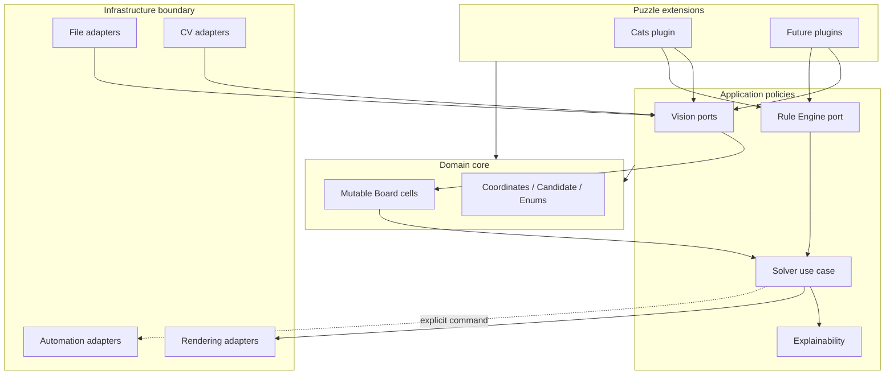

# LogicForge Architecture

## Purpose

LogicForge separates screenshot interpretation, puzzle semantics, deduction,
presentation, and operating-system side effects. The architecture is designed to
support many puzzle families without turning the core solver into a collection of
game-specific conditions.

The codebase currently implements in-memory BlueStacks capture, rectangular board
localization, public grid/cell geometry, and puzzle-neutral LAB color classes.
Symbol interpretation, puzzle parsing, rules, solving, and automation remain
deliberately deferred to later milestones.

## Architectural principles

LogicForge applies Clean Architecture and SOLID principles:

- **Dependency rule:** dependencies point toward stable, puzzle-neutral policies.
- **Single responsibility:** detection, parsing, deduction, propagation,
  explanation, rendering, and automation have separate contracts.
- **Open/closed design:** new plugins and adapters extend behavior without editing
  core entities or orchestration interfaces.
- **Substitutability:** implementations honor small typed ports with deterministic
  inputs and outputs.
- **Interface segregation:** consumers depend on narrow detector, renderer, I/O,
  and automation boundaries rather than a shared service object.
- **Dependency inversion:** use cases consume abstractions; application composition
  will inject OpenCV, Pillow, desktop automation, and storage implementations.

The domain packages do not import infrastructure packages. Plugins may depend on
core and public rule/vision contracts, but not on concrete adapters.

## Package responsibilities

| Package | Responsibility | Must not contain |
| --- | --- | --- |
| `core` | Single mutable solver board and puzzle-neutral values | CV algorithms, I/O, plugin rules |
| `vision` | Screenshot models and detector/parser ports | Deduction logic, mouse actions |
| `rules` | Stateless rule contracts and engine boundary | Puzzle-specific branching, mutation |
| `solver` | Deduction use-case and state-transition boundaries | Image processing, UI code |
| `plugins` | Puzzle-specific parsing and rule composition | Core-framework special cases |
| `explain` | Semantic explanations and formatting ports | Rule execution, board mutation |
| `visualization` | Board and diagnostic rendering ports | Persistence decisions |
| `automation` | Explicit OS input boundaries | Deduction policy |
| `io` | Image loading and artifact export ports | Puzzle interpretation |
| `config` | Immutable application settings | Environment reads in domain code |
| `utils` | Narrow logging and timing ports | Puzzle behavior |

## Overall architecture



## Data flow

The planned end-to-end flow is a sequence of typed transformations:

1. A capture or I/O adapter creates an immutable in-memory BGR `Screenshot`.
2. A plugin parser coordinates board, grid, color, and later symbol detectors.
3. `Board(ColorDetectionResult)` copies `color_matrix` once into the sole mutable
   `cells: list[list[str]]` solver representation.
4. The solver supplies that same board and ordered plugin rules to the Rule Engine.
5. Rules return proposed `RuleOutcome` records; validated outcomes are applied to
   the same matrix through `set_cat` and `set_blocked`.
6. No immutable board, parallel state matrix, region map, or per-change board copy
   is created.
7. Outcomes may later become semantic `Explanation` records with provenance.
8. Renderers present the current board. Automation receives only explicit,
   separately authorized commands derived from a validated state.

No stage may communicate by hidden global state. Failed or ambiguous input will
eventually use typed diagnostics rather than partial mutation or log-only errors.

## Rule Engine

A rule is a stateless policy object with an identifier, description, and one
evaluation operation. Its input is an immutable `RuleContext`; its output is zero
or more proposed outcomes.

The v0.4 engine will be responsible for deterministic ordering, failure isolation,
proposal validation, duplicate handling, conflict detection, and trace capture.
Rules will not apply their own changes. This division keeps each rule independently
testable and gives propagation one authoritative place to enforce invariants.

Puzzle-specific rules live only in plugin packages. Generic engine code must never
branch on a plugin identifier or inspect opaque plugin metadata.

## Vision module

The vision layer uses small ports for independent stages. `BoardDetector` locates
the board, `GridDetector` recovers geometry, and `ColorDetector` produces normalized
observations. `PuzzleParser` is the high-level plugin boundary that interprets
those observations as domain entities.

The public `Screenshot` owns a contiguous, read-only `numpy.ndarray` with an
explicit `uint8` BGR contract. MSS converts native BGRA frames directly into this
model; no component reloads an encoded file.

`BoardDetector` is the inward-facing port. `OpenCvBoardDetector` is an
infrastructure adapter that converts the BGR image to grayscale, applies Gaussian
blur, combines Canny and Otsu-derived masks with morphological closing, extracts
contours, and evaluates rectangular bounding boxes. A scale-relative dilated edge
envelope joins the small visual gaps between adjacent board tiles without parsing
cells. Typed relative thresholds filter title-bar, border, side-toolbar,
advertisement-like, button-sized, and
geometrically implausible candidates without fixing coordinates to one resolution.

Geometry-valid candidates then receive private ROI-level regular-grid validation.
CLAHE normalization, adaptive-threshold edges, Canny edges,
directional morphological opening, and axis projection profiles identify long
horizontal and vertical responses. Nearby responses are clustered by a relative
ROI distance so thick separators count once. Candidate-border responses are
removed, then logical outer boundaries are combined with the ordered internal
positions to estimate rows, columns, spacing variation, and line coverage.

The geometry subscore is:

```text
geometry =
    0.25 * area plausibility
  + 0.25 * rectangularity
  + 0.20 * aspect-ratio plausibility
  + 0.15 * edge-density plausibility
  + 0.15 * expected-location proximity
```

Grid evidence is:

```text
grid =
    0.25 * boundary-count adequacy
  + 0.35 * spacing regularity
  + 0.40 * line coverage

final confidence = 0.40 * geometry + 0.60 * grid
```

Horizontal and vertical values are averaged within each grid component. Spacing
regularity is `clamp(1 - coefficient_of_variation / configured_maximum)`. Boundary
adequacy reaches one at the configured minimum. Coverage is the mean peak
projection response of de-duplicated internal lines. Every component and final
score is clamped to `[0.0, 1.0]`.

Confidence cannot override validation. A candidate is rejected if either axis has
fewer than four boundaries, fewer than three estimated cells, excessive spacing
variation, insufficient coverage, or if aggregate grid evidence is below its
threshold. This fail-closed rule prevents advertisements and UI cards from passing
on geometry alone. Total ordering by confidence, area, position, and size resolves
ties reproducibly. Diagnostics contain only primitive measurements, normalized
line-position tuples, and rejection reasons; no contours or OpenCV types cross the
infrastructure boundary.

The public `OpenCvGridDetector` reuses that exact analyzer and mandatory validation
path; it does not run a second line detector. It validates the supplied
`BoardDetection`, crops only that board ROI, converts normalized boundaries into
full-screenshot integers using deterministic round-half-up, and rejects any
duplicate or reversed pixel result. Outer lines are fixed exactly to the board's
half-open bounds.

`GridDetection` contains every horizontal and vertical boundary, derived row and
column counts, row-major immutable `CellBounds`, and the grid-evidence confidence.
Coordinates are screenshot-relative. A cell includes its top-left pixel and excludes
`x + width` and `y + height`, so consecutive cells tile the complete board without
gaps or overlap. Grid confidence intentionally excludes board confidence. Typed
`GridDetectionError` diagnostics preserve normalized positions, converted lines,
spacing, coverage, score, and rejection reasons without exposing matrices.

OpenCV debug rendering is a separate infrastructure concern. It copies the
immutable source pixels and may draw selected/rejected candidates, de-duplicated
horizontal and vertical lines, estimated dimensions, coverage, and grid score.
Persistence occurs only through an explicit `debug=True` call, so ordinary
detection has no filesystem side effects.

The grid renderer separately draws the public board boundary, all public lines,
cell centers, and optional row/column labels. Its normal and rejected overlays are
also explicit debug-only persistence paths.

`OpenCvColorDetector` consumes only the immutable screenshot and public grid. It
crops the central configured fraction of every half-open cell, converts BGR pixels
to OpenCV's 8-bit LAB representation, computes an initial channel median, removes
the configured farthest-pixel fraction, and takes a final median. This robustly
estimates the background without assigning semantics to minority symbol strokes.

Cell representatives are grouped with deterministic complete-link agglomeration:
two clusters merge only when every cross-cluster LAB distance is within the typed
threshold. This prevents transitive chains from joining endpoints that are not
actually similar. Final centroids are sorted lexicographically by LAB value and
receive contiguous logical identifiers `C0..Cn`. The IDs encode equality only and
do not name colors.

Per-cell confidence is deterministic:

```text
homogeneity = clamp(1 - robust_spread / maximum_within_cell_spread)
cluster_fit = clamp(1 - distance_to_centroid / cluster_distance_threshold)
cell confidence = 0.70 * homogeneity + 0.30 * cluster_fit
global confidence = arithmetic mean of all cell confidences
```

Public immutable results contain row-major `ColorObservation` records, the direct
matrix of logical IDs, class count, global confidence, LAB representatives, and
primitive diagnostics. OpenCV arrays remain inside infrastructure. A separate
renderer labels every cell and may persist an overlay only with explicit debug
behavior. No color stage imports puzzle plugins, solver code, or automation.

The domain `Board` is intentionally different from immutable vision transport.
Its constructor copies `ColorDetectionResult.color_matrix` into nested lists once.
Thereafter `C<n>`, `K`, and `X` coexist in that single mutable matrix, and all
solver-facing queries and assignments operate on it directly. `Board` contains no
`Cell` objects, `Region` objects, snapshot conversion, or second state matrix.
Unresolved `C<n>` entries may transition once to either `K` or `X`. Both final
states accept an identical idempotent assignment but reject the opposite state
with `BoardStateError`; validation occurs before assignment, so a conflict cannot
partially mutate the board.

## Solver module

The solver is an application use case, not a collection of puzzle rules. It will
coordinate repeated engine evaluations and propagation until the board is solved,
stalled, contradictory, cancelled, or limited by policy.

Solver iterations will mutate the one supplied `Board` through its narrow methods.
Lifecycle and explanation metadata may record what changed, but must not duplicate
the board matrix or create a board copy after every deduction. Search, guessing,
or probabilistic strategies are outside the v1.0 scope unless later introduced
through explicit strategy contracts.

## Plugin system

`PuzzlePlugin` is the extension boundary for metadata, parser composition, and an
ordered rule catalog. The planned registry will discover plugins through Python
entry points and enforce identifier and framework-version compatibility.

Plugins may:

- map visual evidence into the generic board model;
- define plugin-owned metadata and region semantics;
- contribute small stateless rules;
- provide plugin-specific rendering assets through future contracts.

Plugins may not invoke automation, mutate solver state, configure global logging,
or require the core package to recognize their puzzle type.

## Explainability system

Explainability begins at the rule outcome, not after solving. Each proposed and
applied transition retains a rule identifier, deduction kind, affected coordinates,
summary, and future structured evidence. `Explanation` is presentation-neutral;
formatters convert it to text, Markdown, JSON, or UI content.

The v0.6 design will add structured premises, conclusions, localization keys, and
links between state transitions. A formatter must never invent evidence or rerun a
rule to explain a historical result.

## Composition and side effects

A future composition root will instantiate settings, adapters, plugin registry,
engine, propagation strategy, and solver. Constructors will receive dependencies
explicitly. Environment variables, file reads, image decoding, logs, clocks,
rendering, and desktop input remain at the outer boundary.

Automation is intentionally separated from solving. It will require dry-run mode,
screen and focus validation, rate limits, explicit user authorization, and an
emergency stop before v0.7 can emit real input events.

## Future roadmap

- **v0.2:** extend screenshot interpretation beyond the implemented board locator.
- **v0.3:** finalize the single mutable string-matrix board contract.
- **v0.4:** implement deterministic engine and atomic propagation.
- **v0.5:** implement Cats parsing, constraints, rules, and fixture corpus.
- **v0.6:** add structured, localized, replayable explanations.
- **v0.7:** add guarded automatic gameplay adapters.
- **v1.0:** stabilize public contracts and Cats compatibility.
- **Future:** add Sudoku, Nonogram, Kakuro, Hashi, and Nurikabe plugins without
  changing puzzle-neutral core policies.

Architectural decisions that change public contracts should be documented as an
ADR under `docs/decisions/` before implementation.
