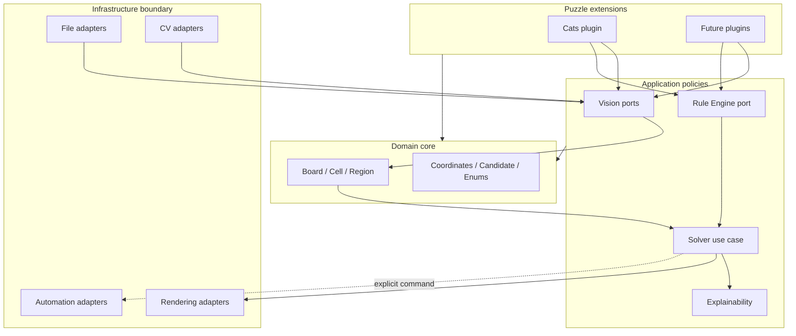

# LogicForge Architecture

## Purpose

LogicForge separates screenshot interpretation, puzzle semantics, deduction,
presentation, and operating-system side effects. The architecture is designed to
support many puzzle families without turning the core solver into a collection of
game-specific conditions.

The v0.1 codebase contains contracts and data shapes only. Algorithms, adapters,
and puzzle rules are deliberately deferred to their roadmap milestones.

## Architectural principles

LogicForge applies Clean Architecture and SOLID principles:

- **Dependency rule:** dependencies point toward stable, puzzle-neutral policies.
- **Single responsibility:** detection, parsing, deduction, propagation,
  explanation, rendering, and automation have separate contracts.
- **Open/closed design:** new plugins and adapters extend behavior without editing
  core entities or orchestration interfaces.
- **Substitutability:** implementations honor small typed ports with deterministic
  inputs and outputs.
- **Interface segregation:** consumers depend on narrow detector, renderer, I/O,
  and automation boundaries rather than a shared service object.
- **Dependency inversion:** use cases consume abstractions; application composition
  will inject OpenCV, Pillow, desktop automation, and storage implementations.

The domain packages do not import infrastructure packages. Plugins may depend on
core and public rule/vision contracts, but not on concrete adapters.

## Package responsibilities

| Package | Responsibility | Must not contain |
| --- | --- | --- |
| `core` | Immutable puzzle-neutral entities and value objects | CV types, I/O, plugin rules |
| `vision` | Screenshot models and detector/parser ports | Deduction logic, mouse actions |
| `rules` | Stateless rule contracts and engine boundary | Puzzle-specific branching, mutation |
| `solver` | Deduction use-case and state-transition boundaries | Image processing, UI code |
| `plugins` | Puzzle-specific parsing and rule composition | Core-framework special cases |
| `explain` | Semantic explanations and formatting ports | Rule execution, board mutation |
| `visualization` | Board and diagnostic rendering ports | Persistence decisions |
| `automation` | Explicit OS input boundaries | Deduction policy |
| `io` | Image loading and artifact export ports | Puzzle interpretation |
| `config` | Immutable application settings | Environment reads in domain code |
| `utils` | Narrow logging and timing ports | Puzzle behavior |

## Overall architecture

## Data flow

The planned end-to-end flow is a sequence of typed transformations:

1. An I/O adapter decodes an external image into a backend-neutral `Screenshot`.
2. A plugin parser coordinates board, grid, color, and later symbol detectors.
3. The parser returns an immutable `Board` plus future diagnostics; it does not
   make deductions.
4. The solver supplies a snapshot and ordered plugin rules to the Rule Engine.
5. Rules return proposed `RuleOutcome` records without mutating the board.
6. A propagation strategy validates the complete proposal set and creates a new
   immutable `SolverState` atomically.
7. Outcomes become semantic `Explanation` records with stable provenance.
8. Renderers present states and explanations. Automation receives only explicit,
   separately authorized commands derived from a validated state.

No stage may communicate by hidden global state. Failed or ambiguous input will
eventually use typed diagnostics rather than partial mutation or log-only errors.

## Rule Engine

A rule is a stateless policy object with an identifier, description, and one
evaluation operation. Its input is an immutable `RuleContext`; its output is zero
or more proposed outcomes.

The v0.4 engine will be responsible for deterministic ordering, failure isolation,
proposal validation, duplicate handling, conflict detection, and trace capture.
Rules will not apply their own changes. This division keeps each rule independently
testable and gives propagation one authoritative place to enforce invariants.

Puzzle-specific rules live only in plugin packages. Generic engine code must never
branch on a plugin identifier or inspect opaque plugin metadata.

## Vision module

The vision layer uses small ports for independent stages. `BoardDetector` locates
the board, `GridDetector` recovers geometry, and `ColorDetector` produces normalized
observations. `PuzzleParser` is the high-level plugin boundary that interprets
those observations as domain entities.

Raw image payloads are opaque at the public boundary. This prevents NumPy, OpenCV,
or Pillow types from leaking throughout the system and allows fixture, local, and
future remote implementations. Detection confidence and diagnostic artifacts will
be first-class outputs before parsing algorithms are introduced.

## Solver module

The solver is an application use case, not a collection of puzzle rules. It will
coordinate repeated engine evaluations and propagation until the board is solved,
stalled, contradictory, cancelled, or limited by policy.

Every iteration produces a new immutable state. This makes runs reproducible,
supports time-travel debugging, and preserves the exact evidence needed for human
explanations. Search, guessing, or probabilistic strategies are outside the v1.0
scope unless later introduced through explicit strategy contracts.

## Plugin system

`PuzzlePlugin` is the extension boundary for metadata, parser composition, and an
ordered rule catalog. The planned registry will discover plugins through Python
entry points and enforce identifier and framework-version compatibility.

Plugins may:

- map visual evidence into the generic board model;
- define plugin-owned metadata and region semantics;
- contribute small stateless rules;
- provide plugin-specific rendering assets through future contracts.

Plugins may not invoke automation, mutate solver state, configure global logging,
or require the core package to recognize their puzzle type.

## Explainability system

Explainability begins at the rule outcome, not after solving. Each proposed and
applied transition retains a rule identifier, deduction kind, affected coordinates,
summary, and future structured evidence. `Explanation` is presentation-neutral;
formatters convert it to text, Markdown, JSON, or UI content.

The v0.6 design will add structured premises, conclusions, localization keys, and
links between state transitions. A formatter must never invent evidence or rerun a
rule to explain a historical result.

## Composition and side effects

A future composition root will instantiate settings, adapters, plugin registry,
engine, propagation strategy, and solver. Constructors will receive dependencies
explicitly. Environment variables, file reads, image decoding, logs, clocks,
rendering, and desktop input remain at the outer boundary.

Automation is intentionally separated from solving. It will require dry-run mode,
screen and focus validation, rate limits, explicit user authorization, and an
emergency stop before v0.7 can emit real input events.

## Future roadmap

- **v0.2:** define parser diagnostics and implement screenshot detector adapters.
- **v0.3:** finalize validated board construction and indexed immutable snapshots.
- **v0.4:** implement deterministic engine and atomic propagation.
- **v0.5:** implement Cats parsing, constraints, rules, and fixture corpus.
- **v0.6:** add structured, localized, replayable explanations.
- **v0.7:** add guarded automatic gameplay adapters.
- **v1.0:** stabilize public contracts and Cats compatibility.
- **Future:** add Sudoku, Nonogram, Kakuro, Hashi, and Nurikabe plugins without
  changing puzzle-neutral core policies.

Architectural decisions that change public contracts should be documented as an
ADR under `docs/decisions/` before implementation.
