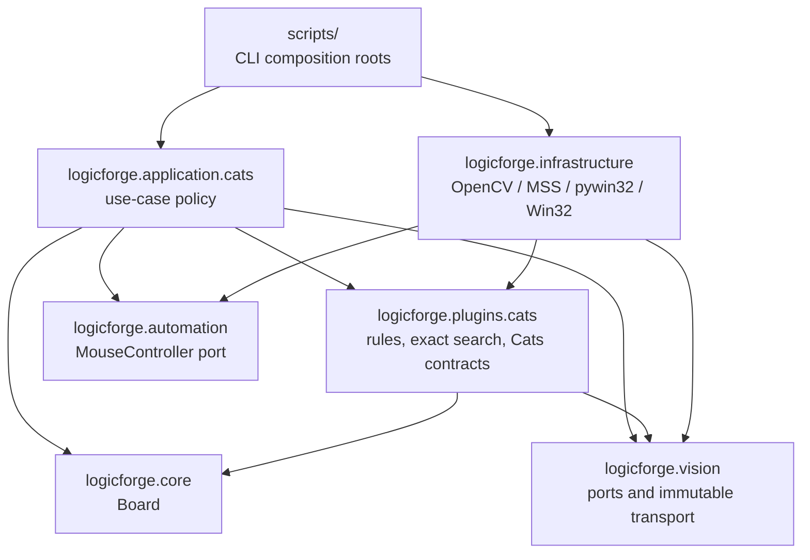

# LogicForge Architecture

## Scope

LogicForge currently implements one complete vertical slice: detecting, solving,
validating, and optionally playing Cats boards from a live BlueStacks window on
Windows. The architecture reflects that working system. It does not introduce a
generic service, registry, rule engine, or parser until another real puzzle proves
that such an abstraction is needed.

The principal design goals are deterministic results, explicit mutable state,
backend-neutral puzzle policy, typed failure boundaries, and fail-closed desktop
automation.

## Layers and dependency rule

### 1. Core

`logicforge.core` contains the small puzzle-neutral logical model:

- `Board`
- `BoardStateError`

The core knows nothing about Cats, OpenCV, Windows, application orchestration, or
mouse automation.

### 2. Backend-neutral ports and transport models

`logicforge.vision` owns immutable screenshot, window, board, grid, cell, and color
transport models plus the active detector and capture ports. `logicforge.automation`
owns the active `MouseController` port and virtual-desktop coordinates.

These modules describe inputs, outputs, invariants, and typed errors. They do not
contain concrete OpenCV, MSS, pywin32, or Win32 input code.

### 3. Cats plugin logic and contracts

`logicforge.plugins.cats` owns:

- Cats board mutations (`place_cat`, `block_cell`);
- seven deterministic deduction rules and their fixed-point loop;
- deterministic exact constraint search;
- tile-lattice result and detector contracts;
- existing-cat result and detector contracts;
- screen-state result and detector contracts.

The plugin imports core and backend-neutral ports, but never imports application
or infrastructure code.

### 4. Cats application orchestration

`logicforge.application.cats` composes use cases over injected ports:

- `analysis` builds `CatsBoardInput` from one screenshot;
- `solving` initializes and solves one logical board;
- `validation` enforces captured geometry and complete-solution invariants;
- `click_plan` maps new cats to desktop targets and executes through a mouse port;
- `autoplay` owns the polling and transition state machine;
- `models` and `presentation` carry typed results and CLI-facing formatting.

Application policy does not import concrete infrastructure.

### 5. Infrastructure adapters

`logicforge.infrastructure` implements the outward-facing details:

- classical OpenCV detectors and debug renderers;
- MSS window capture;
- pywin32 BlueStacks window lookup;
- Win32 mouse input.

Adapters may depend on ports and plugin contracts. They do not own solving,
validation, click-planning, or autoplay policy.

### 6. Composition roots

`scripts/solve_bluestacks_cats.py` and
`scripts/autoplay_bluestacks_cats.py` select concrete OpenCV and Windows adapters,
parse CLI arguments, map exit codes, and print results. Scripts do not import one
another and contain no reusable application policy.

## Dependency graph

Enforced boundaries include:

- core does not import application, infrastructure, or plugins;
- Cats application policy does not import infrastructure;
- Cats plugin logic does not import application;
- OpenCV detectors do not import solve or autoplay policy;
- exact search imports no OpenCV, NumPy, Win32, or application modules;
- production scripts do not import other scripts.

## Runtime data flow

The application moves through typed data rather than shared global state:

```mermaid
flowchart LR
    WI[WindowInfo] --> SS[Screenshot]
    SS --> TG[CatsTileGridDetection]
    TG --> CD[ColorDetectionResult]
    CD --> EC[CatsExistingCatDetection]
    EC --> BI[CatsBoardInput]
    BI --> B[Mutable Board]
    B --> RL[Rules fixed point]
    RL --> ES[Optional CatsExactSearchResult]
    ES --> SB[CatsSolvedBoard]
    SB --> V[Complete solution validation]
    V --> CP[tuple CatClickTarget]
    CP --> MC[MouseController]
```

The concrete steps are:

1. A `WindowLocator` returns `WindowInfo`; a `WindowCapturer` creates one immutable
   `Screenshot` whose BGR pixels are owned and read-only.
2. Cats tile-grid analysis returns both `BoardDetection` and full row-major
   `GridDetection`, including `CellBounds` for supported missing tile slots.
3. `ColorDetector` returns immutable original color equality classes.
4. `CatsExistingCatDetector` inspects only cell-local ROIs and returns immutable
   existing-cat evidence.
5. These results form one frozen `CatsBoardInput`.
6. Solving creates exactly one mutable `Board`, applies existing cats, runs the
   rule loop, and optionally runs exact search.
7. `CatsSolvedBoard` retains the original evidence, final board, status, rule
   count, optional search diagnostics, and click plan.
8. Full validation rechecks every final cat, not merely newly clicked cats.
9. `CatClickTarget` records logical, screenshot, and virtual-desktop coordinates.
10. The injected `MouseController` executes targets only after the autoplay guards
    accept the current window and captured-board fingerprint.

## Immutable and mutable boundaries

Vision and search results are frozen records. Diagnostic contracts expose tuples,
numbers, strings, and other backend-neutral values; OpenCV matrices and contours
do not cross into plugin or application APIs.

`Board` is deliberately mutable and contains the only logical state matrix used
by rules:

- `C<n>` — unresolved cell with original color class `n`;
- `K` — confirmed cat;
- `X` — blocked cell.

`Board(ColorDetectionResult)` copies the immutable color matrix once. Cats actions
then mutate that matrix through validated methods. `K` and `X` are terminal;
contradictory transitions raise `BoardStateError` before mutation.

Placing a cat replaces its `C<n>` value with `K`, so original color cannot be
reconstructed from the final board. `ColorDetectionResult.color_matrix` therefore
remains authoritative for existing cats, exact-search color constraints, and final
one-cat-per-original-color validation.

## Computer vision

### Capture and generic geometry

The Windows adapter captures only a validated BlueStacks window rectangle. The
generic contour-first board and grid detectors remain useful for diagnostics and
as a typed fallback when Cats tile-lattice analysis fails. Coordinates are
screenshot-relative and cells use half-open bounds.

### Cats tile lattice

The primary Cats geometry adapter detects colored tile components and fits regular
column and row center runs independently. Each fitted axis requires repeated real
support in the orthogonal direction. Cartesian assignment happens only after both
maximal supported runs are chosen.

This permits an occupied cell to have no normal tile component while retaining its
`CellBounds`: its row and column still have real support from other components.
Unsupported outer rows or columns are never freely extrapolated. Candidate
ordering prefers larger supported lattices before occupancy, so a full board with
one missing occupied slot can beat a smaller perfect inner subgrid.

### Color classification

The color adapter samples four scale-relative inset corner patches per cell. It
uses robust OpenCV LAB representatives, rejects one corner-level outlier, requires
corner consensus, and performs deterministic complete-link clustering. Logical
IDs such as `C0` express equality only. Central sprites and X marks are not
recognized by the color stage and are deliberately excluded from its evidence.

### Existing cats

Existing-cat detection operates only inside each public `CellBounds` and compares
a central ROI against that cell's already-computed LAB background. Scale-relative
morphology and connected-component geometry measure coherent foreground area,
width, height, and centrality. Thin X marks fail hard area conditions. Accepted
detections must satisfy Cats row, column, original-color, and non-touching
invariants before logical mutation.

### Screen state

The screen-state adapter classifies `BOARD`, `RANKING`, `LEVEL_COMPLETE`, or
`UNKNOWN` using classical, viewport-relative evidence. Warm red/orange CTA geometry
and ranking-card layout are interpreted without OCR or template matching. Detailed
implementation is grouped behind one public OpenCV facade into focused viewport,
level-complete, ranking, and tile-grid-first board-fallback modules. Consumers keep
using the single `OpenCvCatsScreenStateDetector` adapter.
Detailed calibration remains in typed settings and detector source rather than this
document.

## Cats solving

### Atomic board actions

`place_cat()` validates the complete same-color, row, column, and eight-neighbor
exclusion plan before the first write, then applies changes through `Board`.
`block_cell()` performs one idempotent exclusion. Rules do not perform I/O and do
not write `board.cells` directly.

### Seven-rule fixed point

The exact production order is:

1. `SingleRemainingColorCellRule`
2. `SingleRemainingLineCellRule`
3. `MonochromaticLineColorExclusionRule`
4. `ColorSubsetConfinedToLinesRule`
5. `AdjacentColorPairExclusionRule`
6. `ColorConfinedToLineRule`
7. `ImpossibleCatCandidateRule`

After any successful `apply(Board) -> bool`, evaluation restarts from rule one.
The loop ends when a complete pass makes no mutation.

### Exact-search fallback

Search runs only when rules stall. It validates the current board against the
immutable original color matrix, treats current cats as fixed, and explores a
lightweight constraint state without mutating or cloning the real board.

Row, column, and color singletons propagate to a fixed point. A branch assignment
removes candidates sharing its row, column, color, or eight-neighbor area. MRV
chooses the smallest remaining color group, then row, then column under explicit
deterministic tie-breaks. Coordinates are tried row-major.

Search retains the first solution and continues until the tree is exhausted or a
second distinct solution is found. The outcomes are:

- `UNIQUE` — exactly one solution was proved and may be applied;
- `UNSAT` — no complete solution exists;
- `AMBIGUOUS` — at least two distinct solutions exist;
- `LIMIT_REACHED` — the deterministic node budget ended before uniqueness proof.

The first found solution is insufficient because it does not distinguish a forced
board from an arbitrary valid completion. Only `UNIQUE` can lead to clicks.

## Validation and click planning

Complete-solution validation independently requires square board/color geometry,
terminal cells, exactly one cat per row, column, and original color, non-touching
cats, the correct total count, and exact equality between the click plan and all
final cats minus detected existing cats.

Cell centers remain in screenshot coordinates until click planning combines them
with `WindowInfo.bounds`. Negative virtual-desktop coordinates are valid. Before
each action phase, autoplay relocates the BlueStacks window and rejects moved
bounds. Board fingerprints prevent reuse of stale analysis.

Each new cat receives two left clicks with the configured delay. Existing cats
are part of final validation but never appear in the new-click plan.

## Autoplay state machine

The dependency-injected runner owns no OpenCV or Win32 construction. Its phases
process:

- `BOARD`: analyze, validate geometry, solve, validate the complete solution, and
  optionally execute new-cat targets;
- `RANKING`: click the accepted overlay action point when execution is enabled;
- `LEVEL_COMPLETE`: advance through the accepted warm CTA;
- `UNKNOWN`: wait without treating the frame as progress.

Execute mode retries transient board, grid, color, existing-cat, and captured Cats
geometry failures for a bounded three-second window, capturing a new frame every
poll. This does not reset the independent 20-second no-progress timeout. Logical
contradictions, incomplete/ambiguous solutions, mouse errors, capture errors, and
screen-state errors are not converted into transient vision retries.

## Testing strategy

Synthetic fixtures cover multiple lattice sizes, occupied missing slots, corner
color sampling, existing-cat evidence, screen transitions, warm CTA variants, rule
behavior, exact-search outcomes, stale fingerprints, moved windows, negative
coordinates, retry deadlines, click counts, and zero-click failure paths.

Architecture tests parse imports to enforce dependency direction and import every
packaged module. Infrastructure behavior is tested through synthetic images and
fakes; tests do not emit real desktop events.
