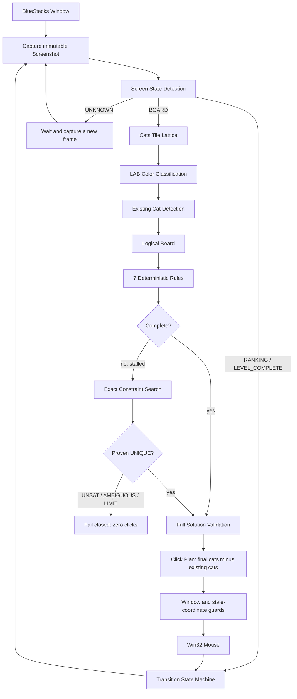

# LogicForge

[](https://github.com/Bombowy/PuzzleMind/actions/workflows/ci.yml)
[](https://www.python.org/)
[](LICENSE)

**Deterministic Computer Vision + Constraint Solving Automation**

LogicForge detects, solves, validates, and automatically plays live Cats puzzle
boards inside a BlueStacks window. The current reference implementation combines
classical OpenCV, deterministic deduction, uniqueness-proving constraint search,
and guarded Win32 mouse automation in one end-to-end pipeline.

The vision path is scale-relative and works from detected cell geometry rather
than hardcoded emulator coordinates or a single reference screenshot. It uses no
OCR, template matching, or machine-learning model.

## What works today

- Live BlueStacks window discovery and immutable in-memory screenshot capture.
- Classical OpenCV board, grid, color, occupied-cell, and screen-state analysis.
- Cats-specific tile-lattice detection with independent row and column pitch
  fitting, orthogonal support diagnostics, and missing slots for occupied cells.
- Deterministic LAB color classification from four inset corner patches, resistant
  to central cats, X marks, highlights, and animation sprites.
- Existing-cat detection inside each `CellBounds`, with row, column, original-color,
  and non-touching invariant validation.
- One mutable logical `Board` using `C<n>`, `K`, and `X` states.
- Seven ordered deterministic deduction rules followed, only when stalled, by
  exact constraint search with singleton propagation and MRV branching.
- Proof of solution uniqueness before any board clicks. `UNSAT`, `AMBIGUOUS`, and
  search-limit outcomes fail closed.
- Full terminal solution validation and exact click-plan equality checks.
- Screenshot-to-desktop mapping through detected cell centers; existing cats are
  excluded from new clicks.
- Explicitly enabled Win32 double-click automation.
- `BOARD`, `RANKING`, `LEVEL_COMPLETE`, and `UNKNOWN` transition state machine.
- Bounded recovery from transient animation frames, stale-board fingerprints,
  stationary overlays, and moved-window coordinates.

## End-to-end pipeline



## Deterministic solving

Rules are the preferred first-line solver. They run in a fixed order and restart
from the highest-priority rule after every real mutation. Exact search is invoked
only if this fixed-point loop stalls with unresolved cells.

The fallback is deterministic constraint backtracking with propagation, not an
unqualified first-solution brute force:

- immutable `ColorDetectionResult.color_matrix` preserves original colors beneath
  current `K` and `X` states;
- existing `K` cells are fixed assignments;
- row, column, and color singletons propagate before and after every branch;
- MRV selects the smallest remaining color, row, or column candidate group;
- branch coordinates are tried in row-major order;
- the search continues after the first solution to look for a second one;
- only one proven solution produces `UNIQUE` and may be applied to the real board.

## Safety model

Automation is local and opt-in. Running the autoplay command without `--execute`
performs one capture-and-analysis dry run and emits no input.

Before board clicks, LogicForge requires:

- a `COMPLETE` logical result;
- terminal `K`/`X` state for every cell;
- exactly one cat per row, column, and immutable original color;
- no orthogonally or diagonally touching cats;
- an exact, duplicate-free click plan equal to final cats minus existing cats;
- unchanged window geometry and a non-stale board fingerprint.

Ambiguous, unsatisfiable, search-limited, contradictory, or incomplete states
produce zero board clicks. A failed transient vision frame also produces zero
clicks and is retried with a newly captured frame for a bounded window. Separate
timeouts guard missing progress and stationary overlays. `Ctrl+C` stops the loop
and prints a summary.

These guards reduce accidental input; they are not a general desktop security
sandbox. Keep the intended BlueStacks window visible and supervise live runs.

## Quick start

### Requirements

- Windows
- Python 3.13
- [`uv`](https://docs.astral.sh/uv/getting-started/installation/)
- BlueStacks App Player
- a Cats puzzle visible in the emulator

Install the locked development environment:

```bash
git clone https://github.com/Bombowy/PuzzleMind.git
cd PuzzleMind
uv sync --locked --all-groups
```

Dry run — one frame, no clicks:

```bash
uv run python scripts/autoplay_bluestacks_cats.py
```

Conservative limited live test:

```bash
uv run python scripts/autoplay_bluestacks_cats.py \
  --execute \
  --click-delay-ms 300 \
  --board-analysis-retry-seconds 3 \
  --max-levels 3
```

Continuous example:

```bash
uv run python scripts/autoplay_bluestacks_cats.py \
  --execute \
  --click-delay-ms 300 \
  --poll-interval-ms 100 \
  --board-analysis-retry-seconds 3 \
  --transition-timeout-seconds 20 \
  --overlay-retry-ms 750 \
  --max-overlay-retries 3 \
  --new-board-delay-ms 300 \
  --max-levels 0
```

The documented 300 ms click delay is a conservative operating example. The code
default remains 10 ms.

## Diagnostics

Every diagnostic below captures a fresh frame and writes an artifact only through
its explicit debug path. None performs mouse input.

```bash
# BlueStacks capture
uv run python scripts/capture_bluestacks.py

# Generic board and grid diagnostics
uv run python scripts/detect_bluestacks_board.py
uv run python scripts/detect_bluestacks_grid.py

# Cats tile lattice, colors, existing cats, and screen state
uv run python scripts/detect_bluestacks_cats_tile_grid.py
uv run python scripts/detect_bluestacks_cats_colors.py
uv run python scripts/detect_bluestacks_cats_existing_cats.py
uv run python scripts/detect_bluestacks_cats_screen_state.py

# One-shot Cats solve; add --execute-clicks only for explicit live input
uv run python scripts/solve_bluestacks_cats.py
```

Generated overlays live under `artifacts/vision/`, which is ignored by Git.

## Architecture

The current production dependency flow is:

```text
scripts composition roots
    -> application/cats orchestration
        -> Cats plugin logic + core + backend-neutral ports

infrastructure adapters implement the ports and are selected only by scripts
```

See [ARCHITECTURE.md](ARCHITECTURE.md) for data ownership, layer boundaries, CV
concepts, rule ordering, exact-search behavior, and automation state transitions.

## Testing

```bash
uv run black --check .
uv run ruff check .
uv run mypy
uv run pytest
uv build
```

Current local validation: **891 passed, 2 skipped, 91% coverage**. Tests use
synthetic images and injected fakes; they do not require a live BlueStacks process,
desktop focus, network access, or real mouse events.

## Limitations

- Windows and BlueStacks are the current capture and automation adapters.
- Cats is the only fully integrated puzzle family.
- Emulator UI or theme changes may require screen-state detector recalibration.
- Classical heuristics assume visually separable tile-lattice, color, and sprite
  evidence.
- Generic contour-first board/grid detection is retained for diagnostics and a
  typed fallback, but arbitrary puzzle applications are not guaranteed.
- Public APIs are pre-1.0 and may be refined as additional real use cases appear.

## Contributing

Read [CONTRIBUTING.md](CONTRIBUTING.md), [ARCHITECTURE.md](ARCHITECTURE.md), and the
[plugin development guide](docs/plugin-development.md) before changing public
contracts or puzzle behavior. Every change must preserve layer boundaries, add
deterministic tests, and pass the complete local quality gate.

## License

LogicForge is available under the [MIT License](LICENSE).
