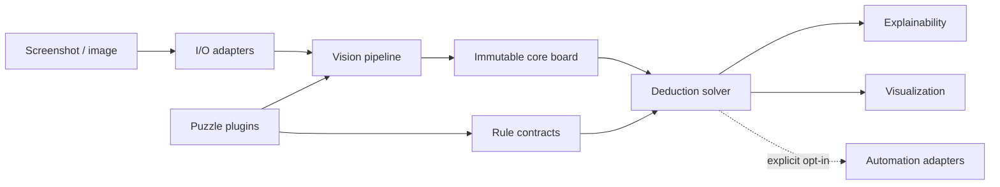

# LogicForge

[](https://github.com/Bombowy/PuzzleMind/actions/workflows/ci.yml)
[](https://www.python.org/)
[](LICENSE)

LogicForge is a modular Computer Vision and rule-based deduction framework for
solving logic puzzle games from screenshots. It is designed around immutable
domain models, deterministic rules, explainable state transitions, and replaceable
infrastructure adapters.

> [!IMPORTANT]
> LogicForge is currently at the **v0.1 architecture milestone**. The repository
> intentionally contains contracts and empty implementations only. It does not yet
> parse screenshots, solve puzzles, or control input devices.

## Architecture

LogicForge follows Clean Architecture: source dependencies point inward toward the
puzzle-neutral core, while vision, file I/O, rendering, and operating-system
automation remain behind explicit ports.



See [ARCHITECTURE.md](ARCHITECTURE.md) for dependency rules, data flow, module
responsibilities, and extension guidance.

## Planned features

- Backend-neutral screenshot and image transport.
- Replaceable board, grid, symbol, and color detectors.
- Immutable puzzle-neutral board, cell, candidate, and region models.
- Deterministic rule evaluation with atomic state propagation.
- Auditable deductions and presentation-neutral explanations.
- Plugin discovery for independently evolving puzzle families.
- Debug rendering and safe, opt-in gameplay automation.
- Strict static typing, reproducible environments, and automated quality checks.

## Roadmap

The initial milestones move from architecture to a stable Cats puzzle plugin:

| Version | Milestone |
| --- | --- |
| v0.1 | Project architecture |
| v0.2 | Screenshot parser |
| v0.3 | Board representation |
| v0.4 | Rule Engine |
| v0.5 | Cats Puzzle Solver |
| v0.6 | Explainable deductions |
| v0.7 | Automatic gameplay |
| v1.0 | Stable Cats plugin |

The detailed scope and acceptance criteria live in [ROADMAP.md](ROADMAP.md).

## Planned puzzle plugins

- **Cats** — the first reference plugin and v1.0 target.
- **Sudoku** — number-placement rules and candidate propagation.
- **Nonogram** — line-clue parsing and binary cell deductions.
- **Kakuro** — sum constraints and candidate combinations.
- **Hashi** — island detection and bridge constraints.
- **Nurikabe** — region connectivity and wall constraints.

Plugin names describe future direction, not currently available functionality.

## Installation

LogicForge requires Python 3.13 and
[`uv`](https://docs.astral.sh/uv/getting-started/installation/).

```bash
git clone https://github.com/Bombowy/PuzzleMind.git
cd PuzzleMind
uv sync --locked --all-groups
```

The committed lockfile gives local development and CI the same dependency graph.

## BlueStacks window capture

The Windows capture pipeline returns the visible BlueStacks App Player window as an
immutable in-memory `numpy.ndarray` in BGR channel order:

```bash
uv run python scripts/capture_bluestacks.py
```

BlueStacks must already be open, visible, and not minimized. The example script
enables `debug=True`, so it additionally writes
`artifacts/vision/bluestacks_capture.png` through OpenCV. Normal service calls use
`debug=False` and perform no filesystem writes. The PNG is never reloaded into the
pipeline. This milestone performs no board detection, parsing, or solving.

## Development

Run all quality tools through `uv` so they use the managed environment:

```bash
uv run black .
uv run ruff check --fix .
uv run mypy
uv run pytest
uv build
```

Production code targets Python 3.13, uses type hints throughout, and is checked in
strict MyPy mode. Refer to [CONTRIBUTING.md](CONTRIBUTING.md) for architectural and
workflow requirements.

## Testing

```bash
uv run pytest
```

The v0.1 tests validate package metadata, immutable domain contracts, and abstract
boundaries. Future milestones will add fixture-based, property, integration, and
end-to-end tests without relying on live game interfaces.

## Contributing

Contributions are welcome. Before opening a pull request:

1. Read [CONTRIBUTING.md](CONTRIBUTING.md) and [ARCHITECTURE.md](ARCHITECTURE.md).
2. Keep puzzle-specific behavior inside a plugin.
3. Add tests and documentation with every behavior change.
4. Run Black, Ruff, MyPy, Pytest, and the package build locally.
5. Follow the [Code of Conduct](CODE_OF_CONDUCT.md).

## License

LogicForge is available under the [MIT License](LICENSE).
