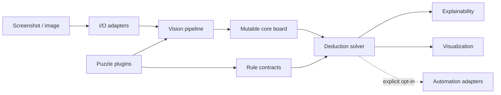

# LogicForge

[](https://github.com/Bombowy/PuzzleMind/actions/workflows/ci.yml)
[](https://www.python.org/)
[](LICENSE)

LogicForge is a modular Computer Vision and rule-based deduction framework for
solving logic puzzle games from screenshots. It is designed around typed vision
results, one explicit mutable solver board, deterministic rules, explainable state
transitions, and replaceable infrastructure adapters.

> [!IMPORTANT]
> LogicForge currently provides the architecture, in-memory BlueStacks capture,
> classical puzzle-board localization, public grid/cell geometry extraction, and
> puzzle-neutral LAB color classification. It does not yet recognize symbols,
> parse puzzles, solve rules, or control input devices.

## Architecture

LogicForge follows Clean Architecture: source dependencies point inward toward the
puzzle-neutral core, while vision, file I/O, rendering, and operating-system
automation remain behind explicit ports.



See [ARCHITECTURE.md](ARCHITECTURE.md) for dependency rules, data flow, module
responsibilities, and extension guidance.

## Planned features

- Backend-neutral screenshot and image transport.
- A replaceable board detector with deterministic diagnostics and confidence.
- Public screenshot-space grid boundaries and immutable cell rectangles.
- Deterministic LAB cell-color classes without hardcoded human color names.
- A future symbol detector port without an implementation yet.
- One mutable puzzle-neutral `list[list[str]]` board for future solver deductions.
- Deterministic rule evaluation with atomic state propagation.
- Auditable deductions and presentation-neutral explanations.
- Plugin discovery for independently evolving puzzle families.
- Debug rendering and safe, opt-in gameplay automation.
- Strict static typing, reproducible environments, and automated quality checks.

## Roadmap

The initial milestones move from architecture to a stable Cats puzzle plugin:

| Version | Milestone |
| --- | --- |
| v0.1 | Project architecture |
| v0.2 | Screenshot parser |
| v0.3 | Board representation |
| v0.4 | Rule Engine |
| v0.5 | Cats Puzzle Solver |
| v0.6 | Explainable deductions |
| v0.7 | Automatic gameplay |
| v1.0 | Stable Cats plugin |

The detailed scope and acceptance criteria live in [ROADMAP.md](ROADMAP.md).

## Planned puzzle plugins

- **Cats** — the first reference plugin and v1.0 target.
- **Sudoku** — number-placement rules and candidate propagation.
- **Nonogram** — line-clue parsing and binary cell deductions.
- **Kakuro** — sum constraints and candidate combinations.
- **Hashi** — island detection and bridge constraints.
- **Nurikabe** — region connectivity and wall constraints.

Plugin names describe future direction, not currently available functionality.

## Installation

LogicForge requires Python 3.13 and
[`uv`](https://docs.astral.sh/uv/getting-started/installation/).

```bash
git clone https://github.com/Bombowy/PuzzleMind.git
cd PuzzleMind
uv sync --locked --all-groups
```

The committed lockfile gives local development and CI the same dependency graph.

## BlueStacks window capture

The Windows capture pipeline returns the visible BlueStacks App Player window as an
immutable in-memory `numpy.ndarray` in BGR channel order:

```bash
uv run python scripts/capture_bluestacks.py
```

BlueStacks must already be open, visible, and not minimized. The example script
enables `debug=True`, so it additionally writes
`artifacts/vision/bluestacks_capture.png` through OpenCV. Normal service calls use
`debug=False` and perform no filesystem writes. The PNG is never reloaded into the
pipeline. The capture command performs no board detection, parsing, or solving.

## BlueStacks puzzle-board detection

The OpenCV adapter consumes the captured in-memory `Screenshot`, evaluates
scale-relative rectangular candidates, and returns a puzzle-neutral
`BoardDetection`. To capture BlueStacks, detect the board, print diagnostics, and
explicitly save an annotated overlay, run:

```bash
uv run python scripts/detect_bluestacks_board.py
```

The overlay is written to `artifacts/vision/board_detection.png`. Calling the
detector normally never writes files. A missing or unreliable board raises a typed
`BoardDetectionError` with candidate diagnostics instead of returning guessed
coordinates.

Geometry alone is not sufficient for acceptance. Every plausible candidate ROI
must contain regular horizontal and vertical separator evidence: enough distinct
boundaries for at least a 3x3 grid, consistent spacing, substantial line coverage,
and a minimum aggregate grid score. Confidence combines 40% geometric evidence
with 60% grid evidence, while all grid conditions remain mandatory hard checks.
The same internal analysis path is reused by the public `GridDetector`; separator
detection is not duplicated.

## Public grid and cell geometry

The public OpenCV grid adapter converts `Screenshot + BoardDetection` into complete
screenshot-space grid boundaries and immutable row-major `CellBounds` records:

```bash
uv run python scripts/detect_bluestacks_grid.py
```

The command saves an explicit debug overlay to
`artifacts/vision/grid_detection.png`. Horizontal and vertical line tuples include
the outer board boundaries. Cell rectangles use half-open pixel intervals: `x` and
`y` are inclusive, while `x + width` and `y + height` are exclusive. Consequently,
adjacent cells share boundaries without overlapping, and the complete cell set
covers the board without gaps. Coordinates are relative to the captured screenshot,
never the desktop or cropped ROI.

Grid confidence is the shared grid-evidence score only; board confidence is not
blended into it. Invalid boards, unreliable grids, collapsed rounded boundaries,
or non-positive cells raise `GridDetectionError` without returning partial geometry.
This grid stage does not recognize cell content and remains independently reusable
by color and future symbol adapters.

## Puzzle-neutral cell-color detection

`OpenCvColorDetector` consumes the existing in-memory `Screenshot` and public
`GridDetection`. For every cell it samples the central 65% region, converts the BGR
pixels to OpenCV LAB, rejects the most distant color outliers, and derives a robust
representative with a median. It then performs deterministic complete-link
clustering without assuming a palette or a fixed number of classes. Logical IDs
such as `C0`, `C1`, and `C2` express only color equality; they are not human color
names.

Run the complete capture-to-color workflow with:

```bash
uv run python scripts/detect_bluestacks_colors.py
```

The command prints the board bounds, grid dimensions, detected class count,
row-major color matrix, and mean confidence. Explicit debug mode writes
`artifacts/vision/color_detection.png` with the board, cell outlines, class labels,
representative-color swatches, and global summary. Normal detector calls do not
write files. The result is immutable and ready for a future parser/solver, but this
milestone does not detect cats, X marks, other symbols, or puzzle rules.

## Mutable logical board

`Board(ColorDetectionResult)` copies the immutable detected `color_matrix` once
into its only solver-facing representation: `cells: list[list[str]]`. Entries use
`C0`, `C1`, ... while unresolved, `K` for a confirmed cat, and `X` for an excluded
cell. `get`, `set_cat`, `set_blocked`, `is_unknown`, `is_cat`, and `is_blocked`
operate directly on that matrix. The board does not create immutable snapshots,
region objects, or a parallel state matrix after mutations. `K` and `X` are final:
setting the same value again is idempotent, while `K -> X` or `X -> K` raises
`BoardStateError` before any cell is changed.

### Troubleshooting small BlueStacks windows

If board or grid detection fails at a very small BlueStacks size, enlarge the
emulator window and retry. A captured resolution of at least approximately
440x470 is recommended. This is a practical operational recommendation, not a
guaranteed universal minimum or a detector acceptance limit; detection is still
attempted below this size.

## Development

Run all quality tools through `uv` so they use the managed environment:

```bash
uv run black --check .
uv run ruff check .
uv run mypy
uv run pytest
uv build
```

Production code targets Python 3.13, uses type hints throughout, and is checked in
strict MyPy mode. Refer to [CONTRIBUTING.md](CONTRIBUTING.md) for architectural and
workflow requirements.

## Testing

```bash
uv run pytest
```

The test suite validates architecture boundaries, immutable image transport,
window ownership, synthetic board/grid detection, deterministic cell tiling,
advertisement rejection, deterministic LAB color grouping, confidence bounds, and
opt-in debug persistence. Tests never require a live BlueStacks process, desktop
focus, monitor geometry, or
network access.

## Contributing

Contributions are welcome. Before opening a pull request:

1. Read [CONTRIBUTING.md](CONTRIBUTING.md) and [ARCHITECTURE.md](ARCHITECTURE.md).
2. Keep puzzle-specific behavior inside a plugin.
3. Add tests and documentation with every behavior change.
4. Run Black, Ruff, MyPy, Pytest, and the package build locally.
5. Follow the [Code of Conduct](CODE_OF_CONDUCT.md).

## License

LogicForge is available under the [MIT License](LICENSE).
